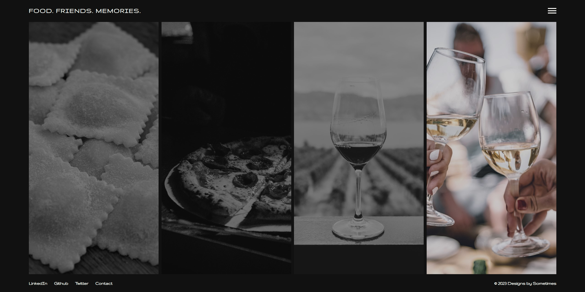
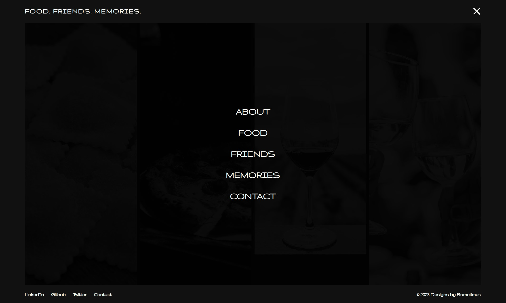
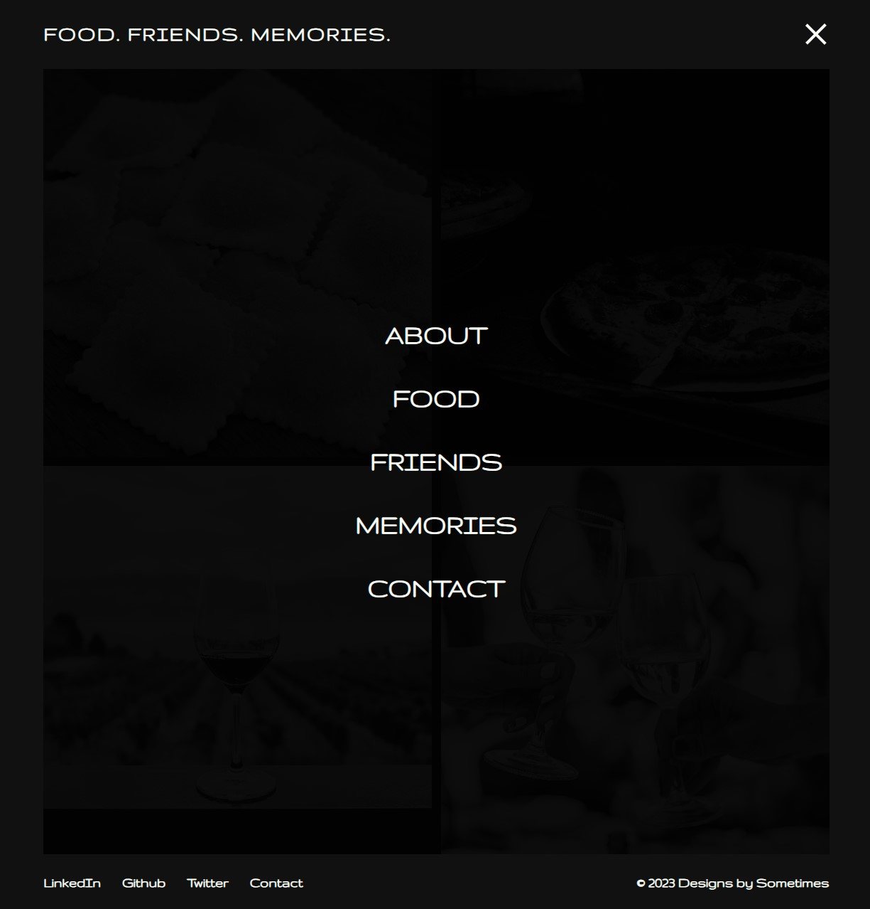
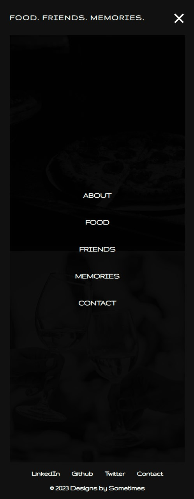

# Food. Friends. Memories.

The epicurean world has been graced by many, but few stand out quite like Alex Palmer. With a decade under her belt in the hospitality industry, Alex has mingled with the flavors of the world. Her zest for food, however, didn’t just end at savoring it, but in crafting it. As a Michelin Star Pastry Chef, Alex has brought smiles to thousands with her delicate and intricate pastries that are as much a visual treat as they are a culinary delight.

But the culinary journey isn’t just about food for Alex. It’s about the stories that are weaved around a table, the laughter that echoes when friends gather, and the nostalgia of childhood dishes. Realizing the strength of these intertwined elements - food, friends, and memories - Alex started her blog, hoping to share her tales and recipes with the world.

**“Savor the Moment, Relish the Memory.”**

# What You're Creating

|                     Desktop                      |
| :----------------------------------------------: |
|  |

|                     Tablet                     |                     Mobile                     |
| :--------------------------------------------: | :--------------------------------------------: |
|  |  |

# Who You're Creating For

### Liam - The Novice Foodie
-   **Age:** 24
-   **Occupation:** Software Developer
-   **Description:** Liam recently discovered the joy of cooking and often hosts small get-togethers with friends. He is always on the lookout for new recipes to impress his peers.
-   **User Story:** Liam wants to find a dessert recipe that is both delicious and visually stunning. He comes across Alex’s blog and is immediately drawn in by her storytelling and beautifully photographed pastries. Using one of her Michelin-star recipes, he successfully becomes the star chef of his gathering.

### **Sophia - The Nostalgic Mom**
-   **Age:** 37
-   **Occupation:** School Teacher
-   **Description:** Sophia loves reminiscing about her childhood and is eager to recreate the dishes that remind her of her grandma’s kitchen.
-   **User Story:** Sophia stumbles upon Alex’s blog while searching for a traditional dish. She finds not only the recipe but also a heartwarming story that Alex shared about her own grandmother. Sophia feels a deep connection and becomes a regular reader.

### **Daniel - The Aspiring Chef**
-   **Age:** 29
-   **Occupation:** Sous Chef at a local bistro
-   **Description:** Daniel has culinary dreams of his own and constantly seeks inspiration from accomplished chefs.
-   **User Story:** Daniel has always admired Michelin-starred chefs and upon finding Alex’s blog, he dives deep into her pastry techniques and anecdotes from her hospitality days. Inspired, he tries incorporating some of her techniques into his own dishes.

# Brand Campaign

By marrying her unique experiences with the universal themes of food, friends, and memories, Alex's “Food. Friends. Memories.” isn't just a blog - it's an experience, a journey that every reader is invited to partake in.

1.  **Recipe Revival Series:** Once a month, Alex can reintroduce a classic dish from her past, interwoven with personal stories, perhaps of her training days or memories associated with that dish.
    
2.  **Friend Feature Fridays:** Alex invites friends from the hospitality industry to share a meal and a memory. It's a video or podcast segment where they cook together, share tales, and dive into the essence of food and camaraderie.
    
3.  **Memory Match Challenge:** Readers are encouraged to share a fond memory, and Alex crafts a dish inspired by it. This engages the community and reinforces the brand’s ethos.
    
4.  **Workshops:** Virtual pastry workshops where fans can learn directly from Alex, understanding not just the craft but also the stories behind each pastry.

# Setup

1. `git clone` this repo to get the starter code.
2. Open the folder called `ffm-mockup` in your code editor.
3. Inside the `ffm-mockup` folder, you'll see that you've been provided with starter code in the `index.html` file. You'll also see that you've been provided with a `css` and `js` directory with their associated `style.css` and `index.js` files. 
4. You'll also see a `assets` folder containing all the images you'll need to complete the project as well as images of the mockups you'll be building out.
5. Write your code in the `style.css`, and `index.js` files to build the project. Make sure to check out the mockups, the comments in the code, and the [style guide](#style-guide) to help you build the project.
5. Open `index.html` in your browser and get started!

# Style Guide

| **Landing Page Style Guide**                                   |                                                                                                                             |
|:---------------------------------------------------------------|:----------------------------------------------------------------------------------------------------------------------------|
| **1. Typography**                                              |                                                                                                                             |
| Font Family                                                    | Gruppo |                                                                                                                             |
| **1.1. Usage**                                                 | **General Text:** Font: Gruppo, regular  Color: #fbfef9                                                                   |
| **Logo:**                                                      | Font: Gruppo, bold, uppercase  Size: 1.5rem (on larger screens) & 1rem (on screens <= 576px)  Letter Spacing: 2px     |
| **Nav Links:**                                                 | Font: Gruppo, bold, uppercase  Size: 2rem (on larger screens) & 1rem (on screens <= 576px)                               |
| **Copyright Text:**                                            | Font: Gruppo, bold  Color: #fbfef9                                                                                        |
| **2. Colors**                                                  |                                                                                                                             |
| **2.1. Primary Colors**                                        | Text & Icon Color: #fbfef9  Background Color: #111111                                                                    |
| **2.2. Interactive Elements**                                  | Hover Color: #DEBA8E                                                                                                        |
| **3. Interactive Components**                                  |                                                                                                                             |
| **Logo:**                                                      | Hover: Text color transition to #DEBA8E                                                                                     |
| **Hamburger Icon:**                                            | Bar color: #fbfef9  Active transformation: Middle bar disappears, top and bottom bars rotate to form an 'X'               |
| **Nav Links:**                                                 | Opacity transition on appearance  Hover: Text color transition to #DEBA8E                                                |
| **Cover Images:**                                              | Grayscale & 0.5 opacity by default  Hover: Full color & 1 opacity                                                        |
| **Social Links:**                                              | Hover: Text color transition to #DEBA8E                                                                                     |
| **4. Layout and Spacing**                                      |                                                                                                                             |
| **General:**                                                   | Box Model: box-sizing: border-box  Content Width: 90%, centered with margin auto  Minimum body height: 100vh          |
| **Navbar:**                                                    | Horizontal padding: 1.5rem  Flexbox for horizontal alignment                                                             |
| **Main Content:**                                              | Flexbox for content alignment  Grid for image alignment with defined grid areas. Adjustments in grid areas and display properties for responsive design. |
| **Footer:**                                                    | Horizontal padding: 1.5rem  Flexbox for content alignment. Directional adjustments for responsive design.                  |
| **5. Responsive Design**                                       |                                                                                                                             |
| 3 breakpoints:                                                 | Default (Large screens)  1024px  576px                                                                      |
| **Recommendations & Additional Notes:**                        | Consistency: With a clearly defined style guide in place, ensure that any new elements added to the page adhere to the guide for a cohesive look.  Performance: Since you're using transitions and transformations, test your website's performance across various devices to ensure smooth interactions.  Accessibility: Ensure that there's enough contrast between the text and the background for readability. Adjust brightness or add shadows if necessary.  Navigation: The hamburger menu's CSS suggests a mobile overlay navigation. Test its functionality on various devices for smooth user experience. |

# Hungry For More

Your landing page is looking great with its fresh design and clear branding. But why stop there? Let's take things to the next level by adding dynamic functionality and subtle animations to enhance user experience. 

Here's a deeper dive you can take:

### **1. Dynamic Copyright Year**

A small touch, but updating the copyright year automatically can save you time and keep your site current:

-   **JavaScript Date**: Research how to use the JavaScript `Date` object to get the current year and display it in your copyright section.

### **2. Dynamic Hamburger Menu**

The CSS for the hamburger menu is set, but it needs some JavaScript logic to become functional:

-   **Toggle Functionality**: Add an event listener to the hamburger icon. When clicked, toggle a class like `.active` to display or hide the navigation menu.
    
-   **Close on Link Click**: When a navigation link is clicked, the menu should automatically close on mobile views.

|                     Desktop                      |
| :----------------------------------------------: |
|  |

|                     Tablet                     |                     Mobile                     |
| :--------------------------------------------: | :--------------------------------------------: |
|  |  |
    
### **3. Staggered Animations**

Enhance the user's entrance to your site with staggered fade-in animations for your content:

-   **Fade In**: Using JavaScript animate the opacity of your main content sections so they fade in one by one, instead of all at once.
    
-   **Fade Out**: When navigating away or when closing certain components, use a fade-out animation to smoothen the transition.

# You Made It?

Toast to your success with a glass of moscato and uncrustables french toast. You've earned it!